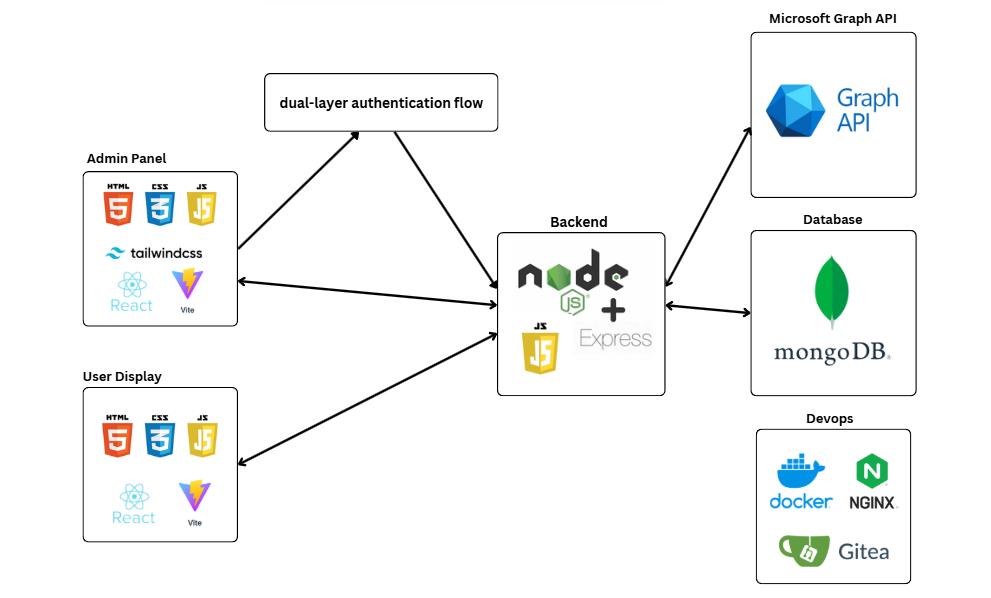
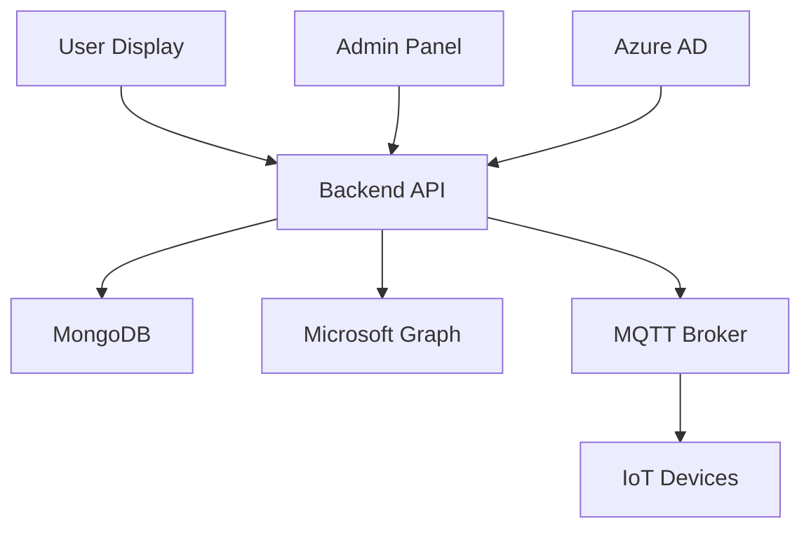

# Smart Conference Display System

> ระบบจัดการห้องประชุมอัจฉริยะที่เชื่อมต่อกับ Microsoft Calendar และควบคุมผ่าน IoT

[](https://nodejs.org/)
[](https://reactjs.org/)
[](https://www.mongodb.com/)
[](https://www.docker.com/)

## 📋 สารบัญ

- [🌟 ภาพรวมโครงการ](#-ภาพรวมโครงการ)
- [🏗️ สถาปัตยกรรมระบบ](#️-สถาปัตยกรรมระบบ)
- [🛠️ การติดตั้งแบบ Development](#️-การติดตั้งแบบ-development)
- [🚀 การติดตั้งแบบ Production](#-การติดตั้งแบบ-production)
- [🔧 การกำหนดค่า Environment](#-การกำหนดค่า-environment)
- [📁 โครงสร้างโปรเจกต์](#-โครงสร้างโปรเจกต์)
- [🔍 Troubleshooting](#-troubleshooting)

## 🌟 ภาพรวมโครงการ

Smart Conference Display System เป็นระบบจัดการห้องประชุมแบบ All-in-one ที่ประกอบด้วย:

- **🖥️ Backend API**: Node.js/Express server พร้อม Microsoft Graph integration
- **👥 Admin Panel**: React + with vite.js
- **📺 Display Frontend**: React + with vite.js
- **🔐 Authentication**: Azure AD integration และ JWT-based auth
- **📊 Database**: MongoDB สำหรับจัดเก็บข้อมูล
- **🏠 IoT Integration**: MQTT protocol สำหรับควบคุมประตูและอุปกรณ์โดยใช้ EMQX Broker



## 🏗️ สถาปัตยกรรมระบบ



---

## 🛠️ การติดตั้งแบบ Development

### 📦 ขั้นตอนที่ 1: เตรียมโปรเจกต์

โหลด initial.sh บน git branch main ที่ /script

```bash
# To make a script executable
chmod +x initial.sh

# โหลดโปรเจกต์และติดตั้ง dependencies
./initial.sh
```

<details>
<summary>🔍 ดูรายละเอียดที่ initial.sh ทำ</summary>

- Clone repositories ทั้งหมด
- ติดตั้ง npm dependencies
- Setup default configuration files

</details>

### 🔧 ขั้นตอนที่ 2: กำหนดค่า Environment

**Backend Environment:**

- มี 2 ไฟล์ อยู่ที่ /be/.env เเละ be/config/.env

**User Display Environment:**

- มี 1 ไฟล์ อยู่ที่ fe/.env

> 📝 **หมายเหตุ**: แก้ไขค่าใน `.env` ให้เหมาะสมกับสภาพแวดล้อม dev ของคุณ

### 🗄️ ขั้นตอนที่ 3: Setup Database

**เปิด Docker Desktop:**

- ตรวจสอบให้แน่ใจว่า Docker Engine กำลังทำงาน
- Windows: เปิดแอป Docker Desktop
- macOS/Linux: `sudo systemctl start docker`

**รัน Docker Compose**<br>
ตรวจสอบ .env ก่อนรัน

```bash
# เข้าไปในโฟลเดอร์ backend
cd conf_backend/be

# Run MongoDB container and Mongo-Express
docker compose up -d --build

# ตรวจสอบสถานะ container
docker compose ps
```

**ผลลัพธ์ที่คาดหวัง:**

```
NAME                IMAGE                       STATUS
mongo               mongo:7                   Up 2 minutes
mongo-express       mongo-express:latest      Up 2 minutes
```

### 🚀 ขั้นตอนที่ 4: รัน Backend Server

```bash
# ในโฟลเดอร์ conf_backend/be
node app.js
```

**Output ที่ถูกต้อง:**

```
✅ MongoDB Connected Successfully
✅ Server running on port 4000
✅ Swagger UI available at http://localhost:4000/api-docs
```

### 🎨 ขั้นตอนที่ 5: รัน Admin Panel

```bash
# เปิด terminal ใหม่
cd conf_admin/admin

# รัน development server
npm run dev
```

**เข้าถึงได้ที่:** `http://localhost:5170`

### 📺 ขั้นตอนที่ 6: รัน User Frontend

```bash
# เปิด terminal ใหม่อีกครั้g
cd conf_frontend/fe

# รัน development server
npm run dev
```

**เข้าถึงได้ที่:** `http://localhost:5173/user/users/api/<floor>/<room>`

### ✅ ตรวจสอบการติดตั้ง

| Service      | URL                                          | Status Check     |
| ------------ | -------------------------------------------- | ---------------- |
| Backend API  | `http://localhost:4000`                      | Welcome Message  |
| Admin Panel  | `http://localhost:5170`                      | หน้า Login       |
| User Display | `http://localhost:5173/user/users/api/15/20` | หน้า Room Status |
| API Docs     | `http://localhost:4000/api-docs`             | Swagger UI       |

---

## 🚀 การติดตั้งแบบ Production

### 📦 ขั้นตอนที่ 1: เตรียมเซิร์ฟเวอร์

โหลด prod.sh บน git branch main ที่ /script

```bash
# สร้าง folder สำหรับวางโปรเจค
mkdir smart-conference-room/

cd smart-conference-room/

# To make a script executable
chmod +x initial.sh

# บนเซิร์ฟเวอร์ production
./initial.sh
```

### 🔐 ขั้นตอนที่ 2: กำหนดค่า Production Environment

**Backend Environment:**

- มี 2 ไฟล์ อยู่ที่ /be/.env เเละ be/config/.env

**User Display Environment:**

- มี 1 ไฟล์ อยู่ที่ fe/.env

> 📝 **หมายเหตุ**: แก้ไขค่าใน `.env` ให้เหมาะสมกับสภาพแวดล้อม dev ของคุณ

### 🌐 ขั้นตอนที่ 3: Setup Reverse Proxy

**Nginx Configuration: reverse-proxy.conf**

```nginx
# Redirect HTTP to HTTPS
server {
    listen 80;
    server_name smartconf.tcc-technology.com;
    return 301 https://$server_name$request_uri;
}

# จัดการ Connection อัตโนมัติ
map $http_upgrade $connection_upgrade {
    default upgrade;
    ''      close;
}

server {
    listen 443 ssl;
    server_name smartconf.tcc-technology.com;

    ssl_certificate     /etc/nginx/certs/fullchain.pem;
    ssl_certificate_key /etc/nginx/certs/privkey.pem;

    # SSL optimization
    ssl_protocols TLSv1.2 TLSv1.3;
    ssl_ciphers HIGH:!aNULL:!MD5;
    ssl_prefer_server_ciphers on;

    location / {
       return 301 /admin/;
    }

    # ************ User frontend  ************
    location /api2/ {
        proxy_pass http://backend:4000/api2/;
        proxy_redirect off;

        # Headers สำคัญสำหรับ SSE
        proxy_http_version 1.1;
        proxy_set_header Connection "";
        proxy_buffering off;
        proxy_cache off;
        proxy_read_timeout 24h;
        proxy_send_timeout 24h;
        chunked_transfer_encoding off;

        # Headers สำหรับ CORS
        # add_header Access-Control-Allow-Origin "$http_origin" always;
        add_header Access-Control-Allow-Origin "https://smartconf.tcc-technology.com" always;
        add_header Access-Control-Allow-Methods "GET, POST, PUT, DELETE, OPTIONS" always;
        add_header Access-Control-Allow-Headers "Authorization, Content-Type, Accept" always;
        add_header Access-Control-Allow-Credentials "true" always;

        # Handle preflight requests
        if ($request_method = 'OPTIONS') {
            add_header Access-Control-Allow-Origin "$http_origin";
            add_header Access-Control-Allow-Methods "GET, POST, PUT, DELETE, OPTIONS";
            add_header Access-Control-Allow-Headers "Authorization, Content-Type, Accept";
            add_header Access-Control-Allow-Credentials "true";
            add_header Content-Length 0;
            return 204;
        }
    }

     # user frontend
    location /user/ {
        proxy_pass http://frontenduser:80/;
        proxy_set_header Host $host;
        proxy_set_header X-Real-IP $remote_addr;
        proxy_set_header X-Forwarded-For $proxy_add_x_forwarded_for;
        proxy_set_header X-Forwarded-Proto $scheme;
    }


    # ************ Admin Panel ************
    location /api1/ {
        proxy_pass http://backend:4000/api1/;
        proxy_redirect off;

        # Headers สำคัญสำหรับ SSE
        proxy_http_version 1.1;
        proxy_set_header Connection "";
        proxy_buffering off;
        proxy_cache off;
        proxy_read_timeout 24h;
        proxy_send_timeout 24h;
        chunked_transfer_encoding off;

        # ส่ง cookies ไปให้ backend
        proxy_set_header Cookie $http_cookie;
        proxy_pass_header Set-Cookie;

        # Headers สำหรับ CORS
        # add_header Access-Control-Allow-Origin "$http_origin" always;
        add_header Access-Control-Allow-Origin "https://smartconf.tcc-technology.com" always;
        add_header Access-Control-Allow-Methods "GET, POST, PUT, DELETE, OPTIONS" always;
        add_header Access-Control-Allow-Headers "Authorization, Content-Type, Accept" always; # allow token
        add_header Access-Control-Allow-Credentials "true" always; # allow cookies

        # Handle preflight requests
        if ($request_method = 'OPTIONS') { # ถ้าเป็น preflight request(not post,get จะส่ง options มา) เพื่อเช็คว่า server รองรับ method ไหนบ้าง เราเลยตอบไป...
            add_header Content-Length 0;
            return 204;
        }
    }

     # Admin frontend
    location /admin/ {
        proxy_pass http://frontendadmin:80/;
        proxy_set_header Host $host;
        proxy_set_header X-Real-IP $remote_addr;
        proxy_set_header X-Forwarded-For $proxy_add_x_forwarded_for;
        proxy_set_header X-Forwarded-Proto $scheme;
    }
}

```

**หมายเหตุ**: ใส่ fullchain.pem เเละ privkey.pem จากโดเมนที่ได้รับ
โครงสร้างไฟล์

```
nginx/
├── certs/
|    ├── fullchain.pem
|    ├── privkey.pem
└── conf.d/
     └── reverse-proxy.conf
```

### 🐳 ขั้นตอนที่ 4: รัน Production Containers ที่ root

```bash
# รัน production stack
docker compose up -d --build

# ตรวจสอบสถานะ
docker compose ps

# ดู logs
docker compose logs -f
```

**Production Stack:**

- MongoDB (พร้อม persistent volume)
- Backend API (load balanced)
- Admin Panel (production build)
- User Frontend (production build)
- Emqx broker
- nodered for network logs

---

## 🔧 การกำหนดค่า Environment

### 🔑 ตัวแปรสำคัญ(มีผลกระทบต่อผู้ใช้งาน ถ้าตั้งค่าผิดพลาด)

| Variable       | Development           | Production                                          | Description                                   |
| -------------- | --------------------- | --------------------------------------------------- | --------------------------------------------- |
| `DEBUG_MODE`   | `'true'`              | `'false'`                                           | โหมด debug (ป้องกันการลบข้อมูลจริง การส่งเมล) |
| `OPEN_MQTT`    | `false`               | `true`                                              | การใช้งาน mqtt protocal                       |
| `EXECPT_ROOMS` | `1503,1504,1519,1520` | ยกเว้นห้องที่กำหนด เช่น การส่งเมลรยืนยันรหัส ลบห้อง |

### 📧 Microsoft Integration

```bash
# Azure AD Configuration
CLIENT_ID='your-azure-app-id'
TENANT_ID='your-tenant-id'
CLIENT_SECRET='your-client-secret'
REDIRECT_URI='https://admin.yourcompany.com/callback' # ปรับเปลี่ยนตาม azure ad

# Microsoft Graph Scopes
SCOPE1='openid'
SCOPE2='profile'
SCOPE3='User.Read'
SCOPE4='Calendars.ReadWrite'
SCOPE5='offline_access'
```

### 🏠 IoT Configuration

```bash
# MQTT Broker (สำหรับ door control)
OPEN_MQTT='true'
MQTT_BROKER_URL='mqtt://localhost:1883'
MQTT_TOPIC_CMD='smartconf/example/cmd' #

# Exception Rooms (ห้องที่ยกเว้นจากการลบอัตโนมัติ)
EXECPT_ROOMS=1503,1504,1519,1520
```

---

## 📁 โครงสร้างโปรเจกต์

Development

```
smart-conference-room/
├── 📄 initial.sh                 # Setup script
│
├── 📁 conf_backend/be/            # Backend API
│   ├── 📝 app.js                 # Main server file
│   ├── ⚙️ config/                # Environment config
│   ├── ⚙️ .env                   # Environment config for Database images
│   ├── 🎮 controllers/           # Route controllers
│   ├── 🗄️ database/              # Database connection
│   ├── 🔐 middlewares/           # Auth & validation
│   ├── 📊 models/                # MongoDB models
│   ├── 🛣️ routes/                # API routes
│   ├── 🔧 services/              # Business logic
│   ├── 📚 swagger/               # API documentation
│   └── 🛠️ utils/                 # Helper functions
│   └── 🐳 docker-compose.yml     # development containers(DB service)
├── 📁 conf_admin/admin/           # Admin Panel (React)
│   ├── 📱 src/components/        # React components
│   ├── 📄 src/pages/             # Page components
│   ├── 🎨 src/styles/            # CSS & styling
│   └── ⚡ vite.config.js         # Vite configuration
│
└── 📁 conf_frontend/fe/           # User Display (React)
    ├── 📱 src/components/        # Display components
    ├── 🎨 src/assets/            # Images & icons
    ├── ⚙️ .env                   # Environment config for Light-Ring api
    ├── 🔄 src/hooks/             # Custom React hooks
    └── ⚡ vite.config.js         # Vite configuration
```

Production

```
smart-conference-room/
├── 📄 prod.sh                 # Setup script
├── 🐳 docker-compose.yml         # production containers
|
│
├── 📁 conf_backend/be/            # Backend API
│   ├── 📝 app.js                 # Main server file
│   ├── ⚙️ config/                # Environment config
│   ├── ⚙️ .env                   # Environment config for Database images
│   ├── 🎮 controllers/           # Route controllers
│   ├── 🗄️ database/              # Database connection
│   ├── 🔐 middlewares/           # Auth & validation
│   ├── 📊 models/                # MongoDB models
│   ├── 🛣️ routes/                # API routes
│   ├── 🔧 services/              # Business logic
│   ├── 📚 swagger/               # API documentation
│   └── 🛠️ utils/                 # Helper functions
│
├── 📁 conf_admin/admin/           # Admin Panel (React)
│   ├── 📱 src/components/        # React components
│   ├── 📄 src/pages/             # Page components
│   ├── 🎨 src/styles/            # CSS & styling
│   └── ⚡ vite.config.js         # Vite configuration
│
└── 📁 conf_frontend/fe/           # User Display (React)
    ├── 📱 src/components/        # Display components
    ├── ⚙️ .env                   # Environment config for Light-Ring api
    ├── 🎨 src/assets/            # Images & icons
    ├── 🔄 src/hooks/             # Custom React hooks
    └── ⚡ vite.config.js         # Vite configuration
```

---

## 🔍 Troubleshooting

### 🚨 ปัญหาที่พบบ่อย

<details>
<summary><strong>❌ MongoDB Connection Failed</strong></summary>

**อาการ:** `MongoNetworkError: failed to connect to server`

**วิธีแก้:**

```bash
# ตรวจสอบ Docker container
docker ps | grep mongo

# รีสตาร์ท MongoDB container
docker compose down
docker compose up -d mongodb

# ตรวจสอบ logs
docker compose logs mongodb
```

**การป้องกัน:**

- ตรวจสอบ port 27017 ว่าถูกใช้งานหรือไม่
- ตรวจสอบ disk space เพียงพอ
- ใช้ connection string ที่ถูกต้อง
</details>

<details>
<summary><strong>🔑 Microsoft Authentication Failed</strong></summary>

**อาการ:** `Error: invalid_client` หรือ `AADSTS7000215`

**วิธีแก้:**

1. ตรวจสอบ Azure AD configuration:

   ```bash
   # ตรวจสอบ environment variables
   echo $CLIENT_ID
   echo $TENANT_ID
   # CLIENT_SECRET ห้ามแสดงใน terminal!
   ```

2. ตรวจสอบ Redirect URI ใน Azure Portal
3. ตรวจสอบ API permissions ได้รับการ grant แล้ว

**การป้องกัน:**

- บันทึก credentials อย่างปลอดภัย
- ตรวจสอบ expiry date ของ client secret
- ใช้ HTTPS ใน production
</details>

<details>
<summary><strong>📡 Port Already in Use</strong></summary>

**อาการ:** `Error: listen EADDRINUSE: address already in use :::4000`

**วิธีแก้:**

```bash
# หา process ที่ใช้ port
lsof -ti:4000

# ฆ่า process (ระวัง!)
kill $(lsof -ti:4000)

# หรือเปลี่ยน port ในไฟล์ .env
PORT=4001
```

</details>

<details>
<summary><strong>🐳 Docker Build Failed</strong></summary>

**อาการ:** Build errors หรือ container ไม่ start

**วิธีแก้:**

```bash
# ลบ containers และ images เก่า
docker compose down --volumes --remove-orphans
docker system prune -a

# Build ใหม่
docker compose up -d --build --force-recreate

# ดู detailed logs
docker compose logs -f
```

</details>

### 🛠️ คำสั่งที่มีประโยชน์

```bash
# ตรวจสอบสถานะทั้งหมด
docker compose ps

# ดู logs แบบ real-time
docker compose logs -f [service-name]

# รีสตาร์ทเฉพาะ service
docker compose restart backend

# เข้าไปใน container
docker compose exec backend sh

# ตรวจสอบ resource usage
docker stats

# Cleanup ระบบ
docker compose down --volumes
docker system prune -af
```

---

## 📚 เอกสารเพิ่มเติม

### 📖 API Documentation

- **Swagger UI**: `http://localhost:4000/api-docs`

---

**Made with ❤️ by the Smart Conference Team**
