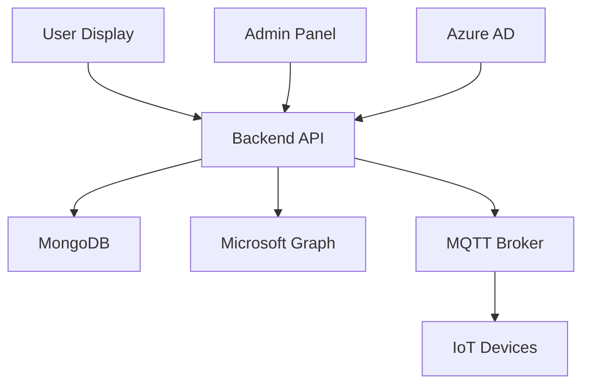

# 🏢 Smart Conference Display System

> ระบบจัดการห้องประชุมอัจฉริยะที่เชื่อมต่อกับ Microsoft Calendar และควบคุมผ่าน IoT

[](https://nodejs.org/)
[](https://reactjs.org/)
[](https://www.mongodb.com/)
[](https://www.docker.com/)

## 📋 สารบัญ

- [🌟 ภาพรวมโครงการ](#-ภาพรวมโครงการ)
- [🏗️ สถาปัตยกรรมระบบ](#️-สถาปัตยกรรมระบบ)
- [⚡ Quick Start](#-quick-start)
- [🛠️ การติดตั้งแบบ Development](#️-การติดตั้งแบบ-development)
- [🚀 การติดตั้งแบบ Production](#-การติดตั้งแบบ-production)
- [🔧 การกำหนดค่า Environment](#-การกำหนดค่า-environment)
- [📁 โครงสร้างโปรเจกต์](#-โครงสร้างโปรเจกต์)
- [🔍 Troubleshooting](#-troubleshooting)
- [📚 เอกสารเพิ่มเติม](#-เอกสารเพิ่มเติม)

## 🌟 ภาพรวมโครงการ

Smart Conference Display System เป็นระบบจัดการห้องประชุมแบบ All-in-one ที่ประกอบด้วย:

- **🖥️ Backend API**: Node.js/Express server พร้อม Microsoft Graph integration
- **👥 Admin Panel**: React-based interface สำหรับจัดการระบบ
- **📺 Display Frontend**: หน้าจอแสดงสถานะห้องประชุมแบบ real-time
- **🔐 Authentication**: Azure AD integration และ JWT-based auth
- **📊 Database**: MongoDB สำหรับจัดเก็บข้อมูล
- **🏠 IoT Integration**: MQTT protocol สำหรับควบคุมประตูและอุปกรณ์

## 🏗️ สถาปัตยกรรมระบบ



## ⚡ Quick Start

> **Prerequisites**: Node.js 18+, Docker Desktop, Git

```bash
# 1. Clone และ setup โปรเจกต์
./initial.sh

# 2. Development mode
npm run dev:all

# 3. Production mode  
docker compose up -d --build
```

---

## 🛠️ การติดตั้งแบบ Development

### 📦 ขั้นตอนที่ 1: เตรียมโปรเจกต์

```bash
# โหลดโปรเจกต์และติดตั้ง dependencies
./initial.sh
```

<details>
<summary>🔍 ดูรายละเอียดที่ initial.sh ทำ</summary>

- Clone repositories ทั้งหมด
- ติดตั้ง npm dependencies
- Setup default configuration files
- ตรวจสอบ system requirements

</details>

### 🔧 ขั้นตอนที่ 2: กำหนดค่า Environment

**Backend Environment:**
```bash
# สร้างไฟล์ .env สำหรับ backend
cp conf_backend/be/config/.env.example conf_backend/be/config/.env
```

**Frontend Environment:**
```bash
# สร้างไฟล์ .env สำหรับ admin panel
cp conf_admin/admin/.env.example conf_admin/admin/.env

# สร้างไฟล์ .env สำหรับ user frontend
cp conf_frontend/fe/.env.example conf_frontend/fe/.env
```

> 📝 **หมายเหตุ**: แก้ไขค่าใน `.env` ให้เหมาะสมกับสภาพแวดล้อม dev ของคุณ

**เปิด Docker Desktop:**
- ตรวจสอบให้แน่ใจว่า Docker Engine กำลังทำงาน
- Windows: เปิดแอป Docker Desktop
- macOS/Linux: `sudo systemctl start docker`

### 🗄️ ขั้นตอนที่ 3: Setup Database

```bash
# เข้าไปในโฟลเดอร์ backend
cd conf_backend/be

# รัน MongoDB container
docker compose up -d --build

# ตรวจสอบสถานะ container
docker compose ps
```

**ผลลัพธ์ที่คาดหวัง:**
```
NAME                IMAGE               STATUS
smartconf_mongodb   mongo:6.0          Up 2 minutes
```

### 🚀 ขั้นตอนที่ 4: รัน Backend Server

```bash
# ในโฟลเดอร์ conf_backend/be
node app.js
```

**Output ที่ถูกต้อง:**
```
✅ MongoDB Connected Successfully
✅ Server running on port 4000
✅ Swagger UI available at http://localhost:4000/api-docs
```

### 🎨 ขั้นตอนที่ 5: รัน Admin Panel

```bash
# เปิด terminal ใหม่
cd conf_admin/admin

# ติดตั้ง dependencies (ถ้ายังไม่ได้ทำ)
npm install

# รัน development server
npm run dev
```

**เข้าถึงได้ที่:** `http://localhost:5170`

### 📺 ขั้นตอนที่ 6: รัน User Frontend

```bash
# เปิด terminal ใหม่อีกครั้g
cd conf_frontend/fe

# ติดตั้ง dependencies (ถ้ายังไม่ได้ทำ)
npm install

# รัน development server
npm run dev
```

**เข้าถึงได้ที่:** `http://localhost:5173`

### ✅ ตรวจสอบการติดตั้ง

| Service | URL | Status Check |
|---------|-----|--------------|
| Backend API | `http://localhost:4000` | GET `/health` |
| Admin Panel | `http://localhost:5170` | หน้า Login |
| User Display | `http://localhost:5173` | หน้า Room Status |
| API Docs | `http://localhost:4000/api-docs` | Swagger UI |

---

## 🚀 การติดตั้งแบบ Production

### 📦 ขั้นตอนที่ 1: เตรียมเซิร์ฟเวอร์

```bash
# บนเซิร์ฟเวอร์ production
./initial.sh
```

### 🔐 ขั้นตอนที่ 2: กำหนดค่า Production Environment

**Backend (.env):**
```bash
# สำคัญ: ตั้งค่าโหมด production
DEBUG_MODE='false'
JWT_SECRET='your-super-secure-production-secret'
DB_URI='mongodb://mongodb:27017/smartconf_prod'
FRONTEND_ADMIN='https://admin.yourcompany.com'
FRONTEND_USERS='https://display.yourcompany.com'
```

**Frontend Environment:**
```bash
# Admin Panel (.env)
VITE_API_URL='https://api.yourcompany.com'
VITE_APP_TITLE='Smart Conference Admin'

# User Display (.env)  
VITE_API_URL='https://api.yourcompany.com'
VITE_DISPLAY_MODE='production'
```

### 🌐 ขั้นตอนที่ 3: Setup Reverse Proxy

**Nginx Configuration (`/etc/nginx/sites-available/smartconf`):**

```nginx
# Backend API
server {
    listen 443 ssl http2;
    server_name api.yourcompany.com;
    
    ssl_certificate /path/to/ssl/cert.pem;
    ssl_certificate_key /path/to/ssl/key.pem;
    
    location / {
        proxy_pass http://localhost:4000;
        proxy_http_version 1.1;
        proxy_set_header Upgrade $http_upgrade;
        proxy_set_header Connection 'upgrade';
        proxy_set_header Host $host;
        proxy_set_header X-Real-IP $remote_addr;
        proxy_set_header X-Forwarded-For $proxy_add_x_forwarded_for;
        proxy_set_header X-Forwarded-Proto $scheme;
        proxy_cache_bypass $http_upgrade;
    }
    
    # SSE endpoints
    location /api1/admin/sse {
        proxy_pass http://localhost:4000;
        proxy_buffering off;
        proxy_cache off;
        proxy_set_header Connection '';
        proxy_http_version 1.1;
        chunked_transfer_encoding off;
    }
}

# Admin Panel
server {
    listen 443 ssl http2;
    server_name admin.yourcompany.com;
    
    ssl_certificate /path/to/ssl/cert.pem;
    ssl_certificate_key /path/to/ssl/key.pem;
    
    location / {
        proxy_pass http://localhost:5170;
        proxy_http_version 1.1;
        proxy_set_header Upgrade $http_upgrade;
        proxy_set_header Connection 'upgrade';
        proxy_set_header Host $host;
        proxy_cache_bypass $http_upgrade;
    }
}

# User Display
server {
    listen 443 ssl http2;
    server_name display.yourcompany.com;
    
    ssl_certificate /path/to/ssl/cert.pem;
    ssl_certificate_key /path/to/ssl/key.pem;
    
    location / {
        proxy_pass http://localhost:5173;
        proxy_http_version 1.1;
        proxy_set_header Upgrade $http_upgrade;
        proxy_set_header Connection 'upgrade';
        proxy_set_header Host $host;
        proxy_cache_bypass $http_upgrade;
    }
}
```

**เปิดใช้งาน:**
```bash
sudo ln -s /etc/nginx/sites-available/smartconf /etc/nginx/sites-enabled/
sudo nginx -t
sudo systemctl reload nginx
```

### 🐳 ขั้นตอนที่ 4: รัน Production Containers

```bash
# รัน production stack
docker compose -f docker-compose.prod.yml up -d --build

# ตรวจสอบสถานะ
docker compose ps

# ดู logs
docker compose logs -f
```

**Production Stack:**
- MongoDB (พร้อม persistent volume)
- Backend API (load balanced)
- Admin Panel (production build)
- User Frontend (production build)
- Redis (สำหรับ session management)

---

## 🔧 การกำหนดค่า Environment

### 🔑 ตัวแปรสำคัญ

| Variable | Development | Production | Description |
|----------|-------------|------------|-------------|
| `DEBUG_MODE` | `'true'` | `'false'` | โหมด debug (ป้องกันการลบข้อมูลจริง) |
| `JWT_SECRET` | `dev-secret` | `strong-secret-32+chars` | คีย์สำหรับ JWT |
| `DB_URI` | `localhost:27017` | `mongodb:27017` | MongoDB connection |
| `FRONTEND_ADMIN` | `localhost:5170` | `https://admin.domain.com` | Admin panel URL |

### 📧 Microsoft Integration

```bash
# Azure AD Configuration
CLIENT_ID='your-azure-app-id'
TENANT_ID='your-tenant-id'
CLIENT_SECRET='your-client-secret'
REDIRECT_URI='https://admin.yourcompany.com/callback'

# Microsoft Graph Scopes
SCOPE1='openid'
SCOPE2='profile'
SCOPE3='User.Read'
SCOPE4='Calendars.ReadWrite'
SCOPE5='offline_access'
```

### 🏠 IoT Configuration

```bash
# MQTT Broker (สำหรับ door control)
OPEN_MQTT='true'
MQTT_BROKER_URL='mqtt://localhost:1883'
MQTT_TOPIC_CMD='smartconf/door/cmd'

# Exception Rooms (ห้องที่ยกเว้นจากการลบอัตโนมัติ)
EXECPT_ROOMS=1503,1504,1519,1520
```

> 📖 **อ่านเพิ่มเติม**: [Environment Configuration Guide](conf_backend/be/config/README.md)

---

## 📁 โครงสร้างโปรเจกต์

```
SmartConfLocal/
├── 📄 initial.sh                 # Setup script
├── 🐳 docker-compose.yml         # Development containers
├── 🐳 docker-compose.prod.yml    # Production containers
│
├── 🔧 conf_backend/be/            # Backend API
│   ├── 📝 app.js                 # Main server file
│   ├── ⚙️ config/                # Environment config
│   ├── 🎮 controllers/           # Route controllers
│   ├── 🗄️ database/              # Database connection
│   ├── 🔐 middlewares/           # Auth & validation
│   ├── 📊 models/                # MongoDB models
│   ├── 🛣️ routes/                # API routes
│   ├── 🔧 services/              # Business logic
│   ├── 📚 swagger/               # API documentation
│   └── 🛠️ utils/                 # Helper functions
│
├── 👑 conf_admin/admin/           # Admin Panel (React)
│   ├── 📱 src/components/        # React components
│   ├── 📄 src/pages/             # Page components
│   ├── 🎨 src/styles/            # CSS & styling
│   └── ⚡ vite.config.js         # Vite configuration
│
└── 📺 conf_frontend/fe/           # User Display (React)
    ├── 📱 src/components/        # Display components
    ├── 🎨 src/assets/            # Images & icons
    ├── 🔄 src/hooks/             # Custom React hooks
    └── ⚡ vite.config.js         # Vite configuration
```

---

## 🔍 Troubleshooting

### 🚨 ปัญหาที่พบบ่อย

<details>
<summary><strong>❌ MongoDB Connection Failed</strong></summary>

**อาการ:** `MongoNetworkError: failed to connect to server`

**วิธีแก้:**
```bash
# ตรวจสอบ Docker container
docker ps | grep mongo

# รีสตาร์ท MongoDB container
docker compose down
docker compose up -d mongodb

# ตรวจสอบ logs
docker compose logs mongodb
```

**การป้องกัน:**
- ตรวจสอบ port 27017 ว่าถูกใช้งานหรือไม่
- ตรวจสอบ disk space เพียงพอ
- ใช้ connection string ที่ถูกต้อง
</details>

<details>
<summary><strong>🔑 Microsoft Authentication Failed</strong></summary>

**อาการ:** `Error: invalid_client` หรือ `AADSTS7000215`

**วิธีแก้:**
1. ตรวจสอบ Azure AD configuration:
   ```bash
   # ตรวจสอบ environment variables
   echo $CLIENT_ID
   echo $TENANT_ID
   # CLIENT_SECRET ห้ามแสดงใน terminal!
   ```

2. ตรวจสอบ Redirect URI ใน Azure Portal
3. ตรวจสอบ API permissions ได้รับการ grant แล้ว

**การป้องกัน:**
- บันทึก credentials อย่างปลอดภัย
- ตรวจสอบ expiry date ของ client secret
- ใช้ HTTPS ใน production
</details>

<details>
<summary><strong>📡 Port Already in Use</strong></summary>

**อาการ:** `Error: listen EADDRINUSE: address already in use :::4000`

**วิธีแก้:**
```bash
# หา process ที่ใช้ port
lsof -ti:4000

# ฆ่า process (ระวัง!)
kill $(lsof -ti:4000)

# หรือเปลี่ยน port ในไฟล์ .env
PORT=4001
```
</details>

<details>
<summary><strong>🐳 Docker Build Failed</strong></summary>

**อาการ:** Build errors หรือ container ไม่ start

**วิธีแก้:**
```bash
# ลบ containers และ images เก่า
docker compose down --volumes --remove-orphans
docker system prune -a

# Build ใหม่
docker compose up -d --build --force-recreate

# ดู detailed logs
docker compose logs -f
```
</details>

### 🛠️ คำสั่งที่มีประโยชน์

```bash
# ตรวจสอบสถานะทั้งหมด
docker compose ps

# ดู logs แบบ real-time
docker compose logs -f [service-name]

# รีสตาร์ทเฉพาะ service
docker compose restart backend

# เข้าไปใน container
docker compose exec backend sh

# ตรวจสอบ resource usage
docker stats

# Cleanup ระบบ
docker compose down --volumes
docker system prune -af
```

---

## 📚 เอกสารเพิ่มเติม

### 📖 API Documentation
- **Swagger UI**: `http://localhost:4000/api-docs`
- **Postman Collection**: [Download](docs/SmartConf.postman_collection.json)

### 🔧 Configuration Guides
- [Environment Variables](conf_backend/be/config/README.md)
- [Microsoft Azure Setup](docs/azure-setup.md)
- [MQTT Configuration](docs/mqtt-setup.md)
- [Nginx Configuration](docs/nginx-setup.md)

### 🎯 Development Guides
- [Contributing Guidelines](CONTRIBUTING.md)
- [Code Style Guide](docs/code-style.md)
- [Testing Guide](docs/testing.md)

### 🚀 Deployment Guides
- [Production Deployment](docs/production-deployment.md)
- [CI/CD Pipeline](docs/cicd.md)
- [Monitoring & Logging](docs/monitoring.md)

---

## 🤝 การสนับสนุน

### 💬 ช่องทางติดต่o
- **Issues**: [GitHub Issues](../../issues)
- **Discussions**: [GitHub Discussions](../../discussions)
- **Email**: smartconf-support@yourcompany.com

### 🎯 Roadmap
- [ ] Real-time room occupancy detection
- [ ] Mobile app for iOS/Android
- [ ] Advanced analytics dashboard
- [ ] Multi-language support
- [ ] Integration with more calendar systems

---

## 📄 License

This project is licensed under the MIT License - see the [LICENSE](LICENSE) file for details.

---

## 🙏 Acknowledgments

- Microsoft Graph API team
- React and Node.js communities
- Docker and MongoDB teams
- All contributors and testers

---

**Made with ❤️ by the Smart Conference Team**

> หากมีคำถามหรือพบปัญหา อย่าลืม[เปิด Issue](../../issues/new) หรือติดต่อทีมพัฒนา!